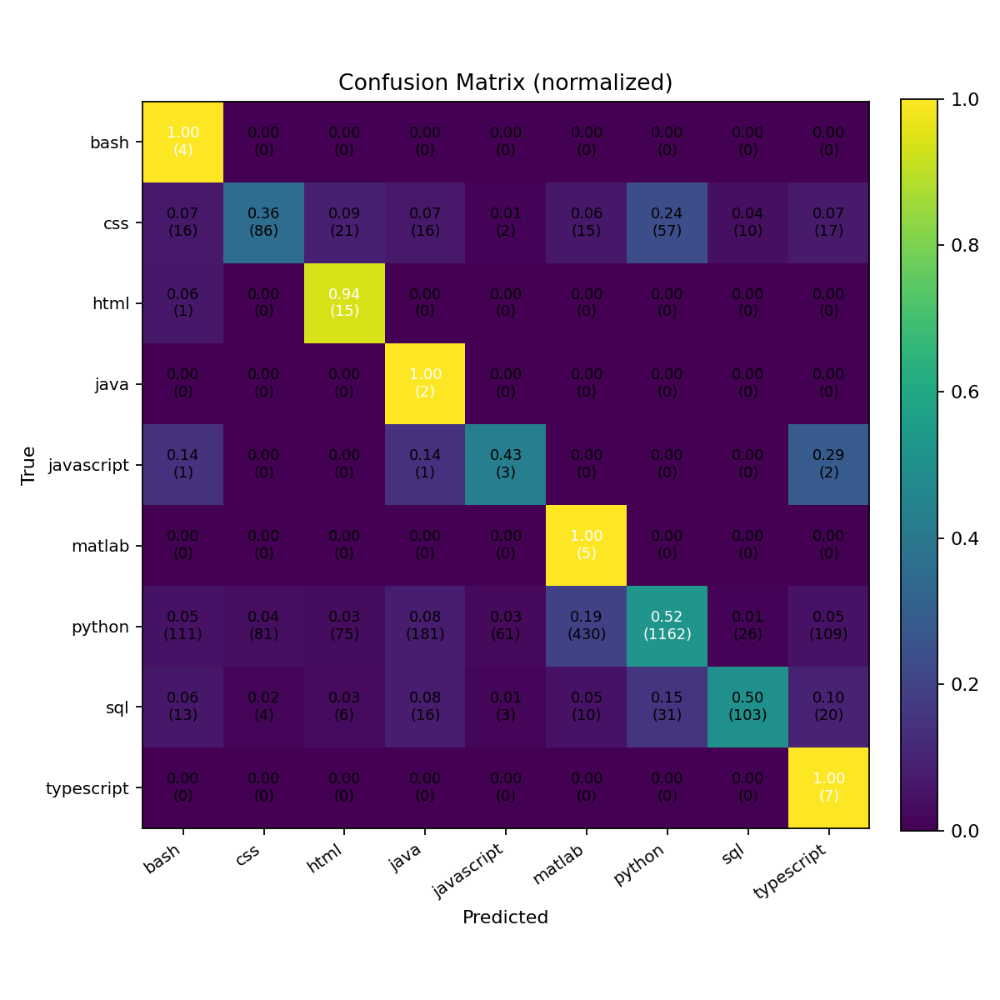

🧰 Code Ask & Generate

Turn a natural-language coding question into executable code using an open-source code LLM.
Runs on CPU or GPU, no accelerate required (but supported). Saves the result to a file like generated_code.py.

What it does

Prompts a coding model with your question/task

Extracts the first fenced code block from the model’s reply

Prints the code to the console and saves it to a file with a sensible extension (.py, .js, .sql, …)

Files

code_ask_and_generate.py — interactive CLI (ask a question → get code)

Requirements

Python 3.9–3.11 recommended

Packages:

pip install --upgrade transformers torch sentencepiece
# optional (faster & lower VRAM on NVIDIA):
pip install bitsandbytes
# optional (for automatic multi-GPU placement):
pip install accelerate


The script runs on CPU out of the box. If CUDA is available, it uses the GPU automatically.
If accelerate is present, it will also use device_map="auto" for smart device placement.

Quick start
python code_ask_and_generate.py


Type a question like:

Write a Python function `is_prime(n)` that returns True if n is prime.


You’ll see the generated code and a line like:

[Saved] ./generated_code_1726293512.py

Usage
Interactive (recommended)
python code_ask_and_generate.py
# then type prompts, e.g.:
# > Implement a JS debounce(fn, wait) utility.
# > Create a minimal Flask API with /sum that adds numbers in JSON input.

One-off (non-interactive)

You can also run it and paste once, then exit.

Configuration

You can tweak behavior via environment variables (or edit the constants at the top of the script):

Variable	Default	Meaning
BASE_MODEL	Qwen/Qwen2.5-Coder-0.5B-Instruct	HF model to load (try larger coder models for quality).
MAX_NEW_TOKENS	512	Max tokens the model can generate per answer.
TEMPERATURE	0.2	Higher = more random; lower = more deterministic.
TOP_P	0.95	Nucleus sampling cutoff.
AUTO_SAVE	1	1 to auto-save to file; 0 to skip saving.
SAVE_DIR	.	Directory where generated files are written.

Examples:

PowerShell (Windows)

$env:BASE_MODEL="Qwen/Qwen2.5-Coder-1.5B-Instruct"
$env:MAX_NEW_TOKENS="800"
python code_ask_and_generate.py


bash (Linux/macOS)

export BASE_MODEL="bigcode/starcoder2-3b"
export AUTO_SAVE=0
python code_ask_and_generate.py

Good prompt examples

Python: “Write a function two_sum(nums, target) that returns the indices of two numbers adding to target.”

JavaScript: “Implement a debounce(fn, wait) helper that delays execution.”

SQL: “Query to find the top 3 products by total revenue in the last 30 days.”

Go: “Command-line tool that prints ‘Hello, <name>!’ when run with --name.”

Tip: ask for just the code. The script already instructs the model to return a fenced code block.

How it works (internals)

Loads the tokenizer/model (uses 4-bit quantization if bitsandbytes + CUDA are available)

Builds a concise instruction prompt; uses the model’s chat template if provided

Generates text and extracts the first fenced code block:

```python
# code here


Determines file extension from the language tag (e.g., python → .py)

Writes to SAVE_DIR/generated_code_<unix_ts>.<ext>

If no fenced block is found, it saves the raw completion.

Changing the model

You can point to any Hugging Face code-instruct model you have permissions to download, for example:

Qwen/Qwen2.5-Coder-1.5B-Instruct (strong, still lightweight)

bigcode/starcoder2-3b

deepseek-ai/deepseek-coder-1.3b-instruct

Larger models generally mean better code but more RAM/VRAM.

Troubleshooting

Q: I see “Using a device_map requires accelerate”
A: Either pip install accelerate or ignore it—the script avoids device_map if accelerate isn’t installed. Use the included script (not older versions).

Q: CUDA out-of-memory or slow?

Try a smaller model (0.5B–1.5B).

Ensure bitsandbytes is installed for 4-bit quant on NVIDIA GPUs.

Reduce MAX_NEW_TOKENS.

Q: HTTPS/timeouts fetching the model

Pre-download once so it’s cached in ~/.cache/huggingface (HF_HOME can change this).

Check network/proxy settings.

Q: Output contains explanations instead of only code

Add to your prompt: “Return only code in a single fenced block.”

Or increase temperature a bit if outputs seem too rigid.

Notes & limitations

Generated code can be incorrect or insecure. Review before running in production.

For privacy, don’t paste secrets or proprietary code in prompts.

This tool does no execution or testing; it just generates code text.

Extend it

Save multiple code blocks or all blocks

Add a flag to specify the output filename/language

Run a linter/formatter (e.g., black, prettier) after generation

Wrap it in a small Streamlit UI
Author
SAGNIK PATRA
